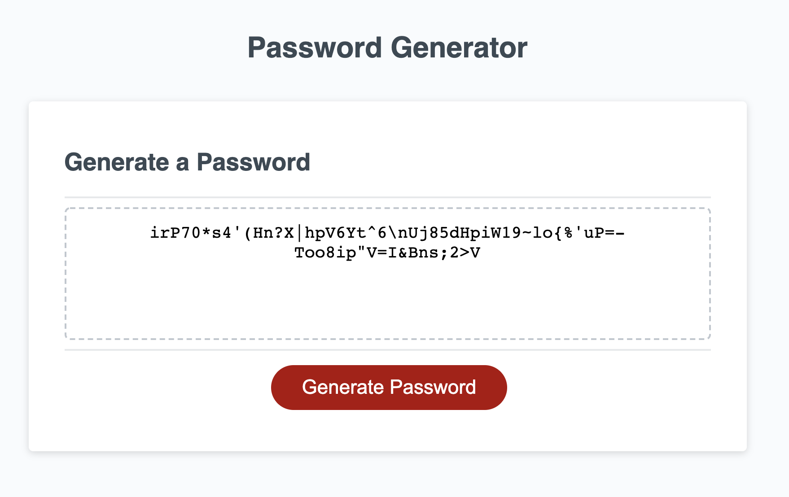

# Password-Generator
A code refactor project involving a password-generator.

## Functionality
When deployed, a simple html page functions as the user interface of the password generator. When the button is pressed, a series of prompts occur requesting info from the user, such as desired password length & character type composition. Error handling and the ability to cancel (and resume password generation after cancel) has been included. Once valid inputs have been given by the user, the password is generated and displayed in a read-only textbox on the webpage. 

## Usage
No installation or deploy is required. This project is hosted live on [Github Pages](https://mlkrauz.github.io/Password-Generator/).